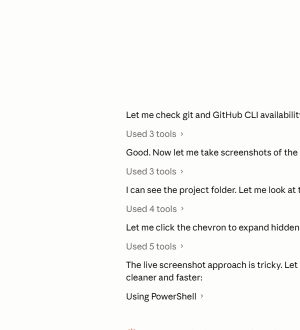
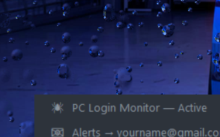
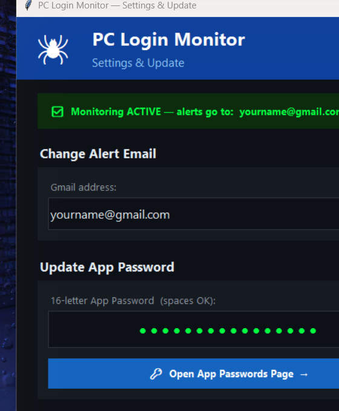
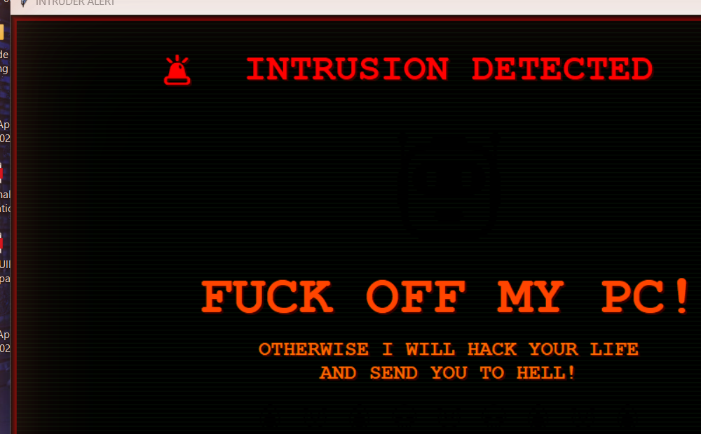
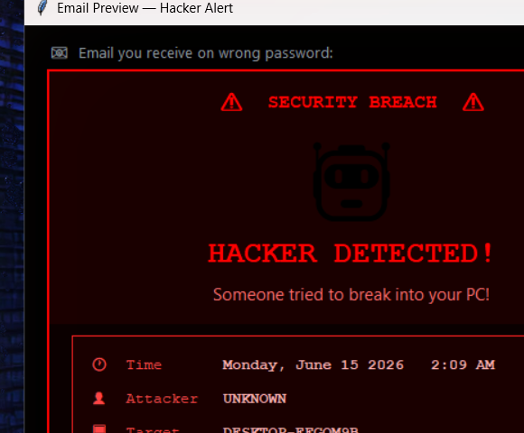
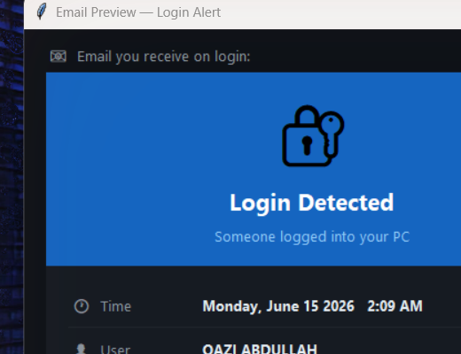

# 🕷️ PC Login Alert

> **Know instantly when someone logs into your PC — and scare them off if they try the wrong password.**

A Windows background app that:
- 📧 **Emails you the moment anyone logs in** to your PC
- 🚨 **Shows a fullscreen "FUCK OFF" hacker warning** when someone types the wrong password
- 📸 **Takes a webcam photo** of the intruder and emails it to you
- 🔊 **Plays a siren** on wrong password attempts
- 🤫 **Runs silently in the background** — auto-starts on every Windows boot, no UAC popup

---

## 📸 How It Looks

### Step 1 — First-time Setup Window
Double-click `START.bat` and the setup guide opens. Your Gmail is auto-detected from Chrome.



---

### Step 2 — Runs in System Tray
After setup, the app hides in the bottom-right system tray. Right-click the 🕷️ spider icon to see options.



---

### Step 3 — Change Settings Anytime
Double-click `SETTINGS.bat` to update your email, app password, or fix auto-start.



---

### What Happens on Wrong Password
When someone types the wrong password at the login screen:

**① Fullscreen warning appears instantly:**



**② You get this email with a webcam photo of the intruder:**



---

### What Happens on Normal Login
Every time anyone logs in, you get this email within seconds:



---

## ⚡ Quick Start (3 Steps)

### Requirements
- Windows 10 or 11
- Python 3.8+ ([download free](https://www.python.org/downloads/))
- A Gmail account

### Install

```
1. Download this project (green Code button → Download ZIP)
2. Extract the ZIP anywhere on your PC
3. Double-click  START.bat
```

### Setup (one-time, takes 2 minutes)

| Step | What to do |
|------|-----------|
| **1** | Click **"Enable 2-Step Verification"** in the app → follow steps on your phone |
| **2** | Click **"Open App Passwords Page"** → type `PCMonitor` → click Create → copy the 16-letter code |
| **3** | Paste the code into the app → click **"Start Monitoring"** |

That's it. The app sends a test email to confirm everything works, then hides in the tray.

---

## 🔁 Auto-Start (No UAC Popup)

After setup, the app creates a **Windows Task Scheduler task** that:
- Starts automatically every time you log into Windows
- Runs with admin rights (needed to detect wrong passwords) **without showing any UAC popup**
- Sends the login alert email within seconds of Windows starting

---

## 📁 Files Explained

| File | Purpose |
|------|---------|
| `START.bat` | Launch / first-time setup |
| `SETTINGS.bat` | Change email, password, or fix auto-start |
| `monitor.py` | The app itself |
| `screenshots/` | Images used in this guide |

---

## 🔧 Change Email Later

Right-click the 🕷️ tray icon → **Change Email**
or double-click `SETTINGS.bat`

---

## 🗑️ Uninstall

1. Right-click tray icon → **Exit**
2. Open Task Scheduler → delete the `PCLoginMonitor` task
3. Delete the project folder
4. Delete `%APPDATA%\PCLoginMonitor\`

---

## ❓ Troubleshooting

**Not getting login emails?**
→ Check spam folder. Add your own Gmail to contacts.

**Wrong password not detected?**
→ Run `START.bat` once and click Yes on the UAC prompt to enable audit policy.

**App not auto-starting?**
→ Open `SETTINGS.bat` → click **Fix Auto-Start**

**"App Passwords not available" on Google?**
→ You must enable 2-Step Verification first (Step 1 in setup).

---

## 🛡️ Privacy

- The app only sends emails **to your own Gmail address**
- Webcam photos are sent only to you and never stored online
- No data is sent to any third-party server
- All config stored locally at `%APPDATA%\PCLoginMonitor\`

---

*Built with Python, tkinter, win32evtlog, Gmail SMTP, pystray, and PIL.*
